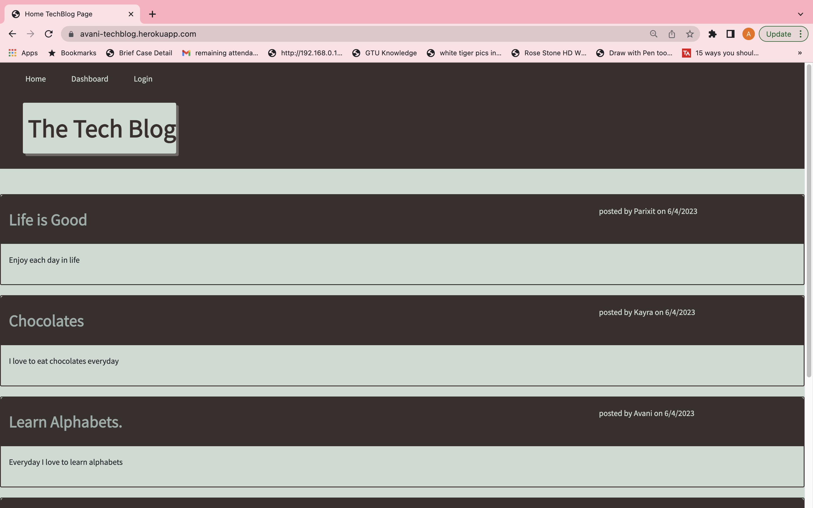
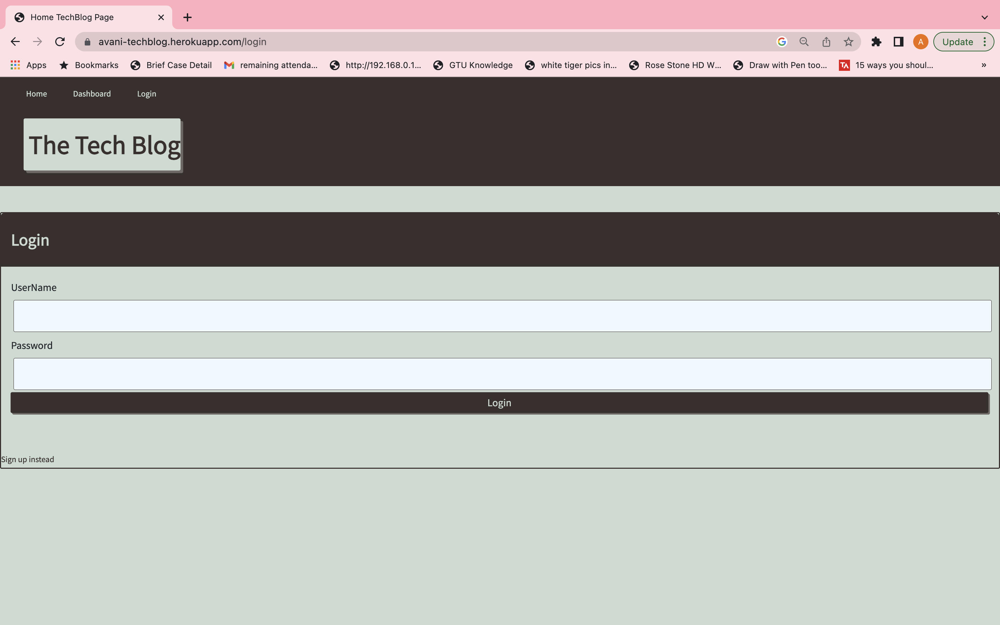
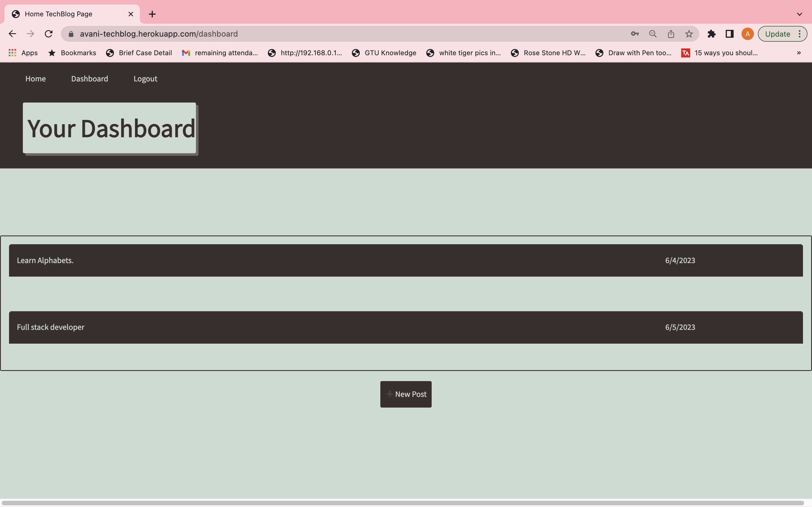
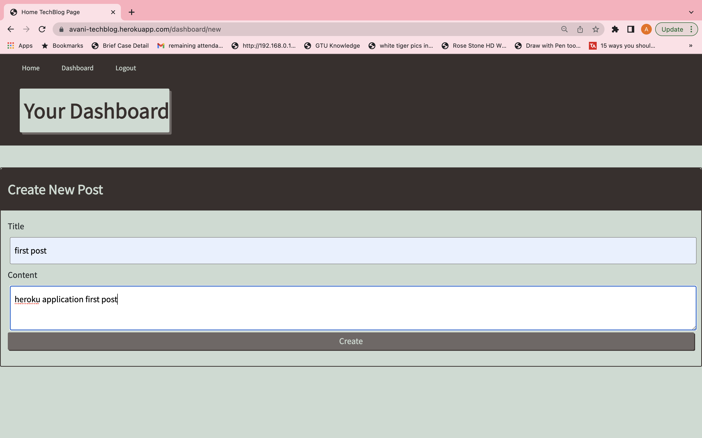
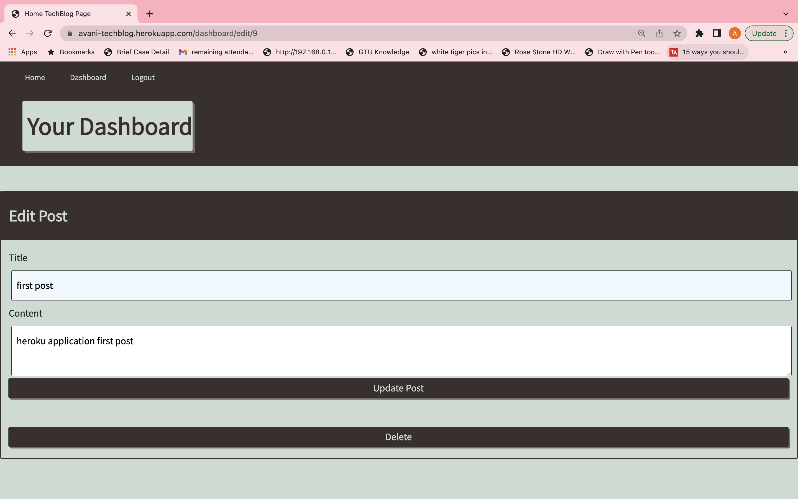
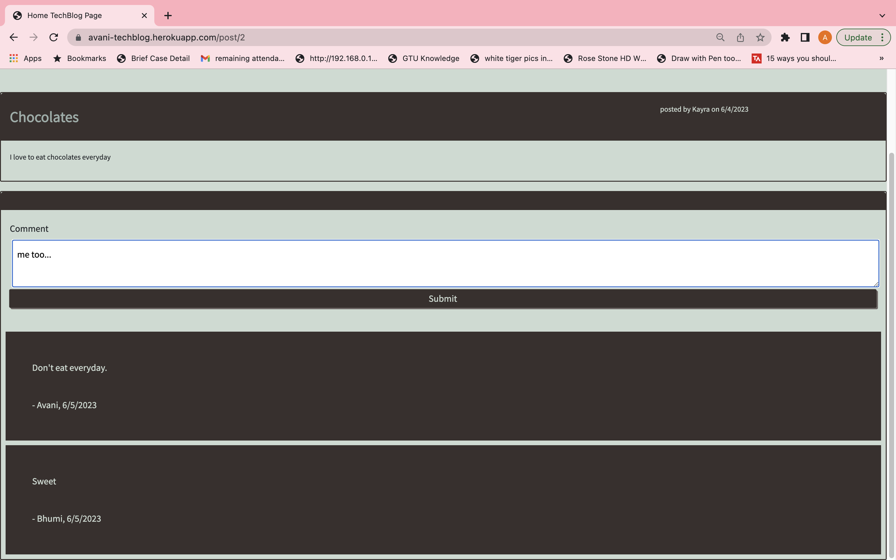

# tech-blog

Tech Blog is a CMS-style blog site similar to a Wordpress site.

# Description

Tech-Blog is a application like a CMS-style blog site similar to a Wordpress site, where developers can publish their blog posts and comments on other developers’ posts as well.This application follow the MVC paradigm in its architectural structure, using Handlebars.js as the templating language, Sequelize as the ORM, and the express-session npm package for authentication.In this user can publish articles, blog posts, and their thoughts and opinions.

In Tech-blog application ,

- when user visit the site first time then user can see homepage with existing blog posts if any have been posted; navigation links for the homepage and the dashboard; and the option to log in.
- When user click on the homepage option user see home page with existing user blogposts.
- when user click on any other links in the navigation then user prompted to either sign up or sign in.
- when user choose to sign up then user prompted to create a userName and password.
- when user click on the sign-up button, then user credentials are saved and I am logged into the site.
- when user revisit the site at a later time and choose to sign in,then user prompted to enter my userName and password.
- when user signed in to the site, then user see navigation links for the homepage, the dashboard, and the option to log out.
- when user click on the homepage option in the navigation, then user taken to the homepage and presented with existing blog posts that include the post title and the date created.
- when user click on an existing blog post, then user presented with the post title, contents, post creator’s userName, and date created for that post and have the option to leave a comment.
- when user enter a comment and click on the submit button while signed in, then the comment is saved and the post is updated to display the comment, the comment creator’s userName, and the date created.
- when user click on the dashboard option in the navigation,then user taken to the dashboard and presented with any blog posts I have already created and the option to add a new blog post.
- when user click on the button to add a new blog post,then user prompted to enter both a title and contents for my blog post.
- when user click on the button to create a new blog post, then the title and contents of my post are saved and I am taken back to an updated dashboard with my new blog post.
- when user click on one of my existing posts in the dashboard, then user able to delete or update my post and taken back to an updated dashboard.
- when user click on the logout option in the navigation,then user signed out of the site.
- when user idle on the site for more than a set time, then user able to view posts and comments but I am prompted to log in again before I can add, update, or delete posts.

In this application, I learned MVC and how to arranged files in model, view,controller style.I used Bcrypt,session,dotenv,express,handlebars,sql,sequelize.so now I can create full functional website.

# Table of Contents

- [Installation](#installation)
- [Usage](#usage)
- [Credits](#credits)
- [License](#license)

# Installation

- first user have to do npm init -y to generate package.json file.

- In this application I used bcrypt,connect-session-sequelize,dotenv,express,express-handlebars,express-session,mysql2,sequelize.so user can install individual of all this modules.like eg. npm install bcrypt or user can write npm install so bydefault all packages are install.

- goto db folder,open terminal and run mysql -u root -p , if user have password then write password.and enter.
  then user run source schema.sql; command and then quit; command. so through this user can intialize database and table .

- on server.js rightclick and open terminal and run command like npm run seed , so data store in table because in packge.json file I write node seeds/index.js in seed. so by default when user write npm run seed it execute seeds folder index.js file.

- user have to write command like, npm run start so application can start.because in package.json file I write node server.js in start so by default when user write npm run start its execute node server.js.

so applicaiton now starts user have to write localhost:3001 in browser so user can see this application output and user can now operate this application using browser.now user can do CRUD opertions in browser.

# Usage

The URL of the functional, deployed application - https://avani-techblog.herokuapp.com/

The URL of the GitHub repository - https://github.com/avanijadeja/tech-blog

# Credits

For this applicaiton, I read different websites some are as under,

- https://developer.mozilla.org/en-US/docs/Glossary/MVC

- https://www.npmjs.com/package/bcrypt

- https://www.npmjs.com/package/sequelize

- https://www.npmjs.com/package/mysql2

- https://www.npmjs.com/package/express-session

- https://getbootstrap.com/

- https://www.w3schools.com/

# License

This project is using the MIT License.

# Badges

